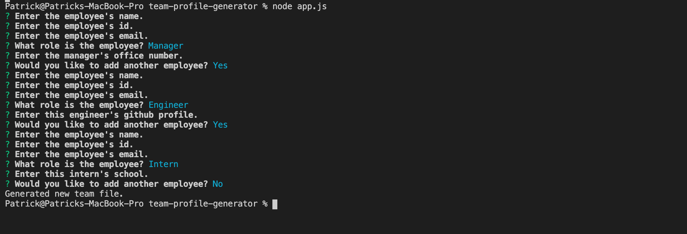
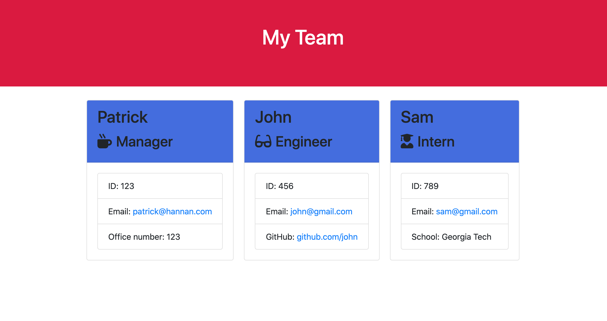

# team-profile-generator

## Description 

This project is a app that will help the user create a visual roster of their engineer and work team. The user can add their co-workers, including managers, engineers, and interns, to a file using inquirer in node.js, allowing for them to see a visual that presents name, id, email, and either office number, github link, or school depending on the employees role. 

## Table of Contents

* [Installation](#installation)
* [Usage](#usage)
* [Credits](#credits)
* [License](#license)

## Installation

The user must download the files from this repository. Those can be accessed [here](https://github.com/patrickhannan/Team-profile-generator).

Once the user downloads these files, they must open the files in VS Code. In VS Code, the user will run a new terminal. In the terminal, the user will change their working directory to the current directory. 

Run "npm install" to install the app.

## Usage 

Once installed, the user can run "node app.js" in their current directory. A series of prompts will run, and the user will answer these using their employees information. After answering all prompts, the user will see that a new file has been generated called "team.html" which will be deployed to show the employee team.

Below is a image of how the page will look when the user is prompted. (Note: each question will display one at a time.)

The following image shows how the roster app will look.

## Credits

* [When Function](https://stackoverflow.com/questions/49520423/is-there-a-way-to-use-previous-answers-in-inquirer-when-presenting-a-prompt-inq)
* [Node.js](https://nodejs.org/en/)

## License

MIT License

Copyright (c) 2020 Patrick Hannan

Permission is hereby granted, free of charge, to any person obtaining a copy of this software and associated documentation files (the "Software"), to deal in the Software without restriction, including without limitation the rights to use, copy, modify, merge, publish, distribute, sublicense, and/or sell copies of the Software, and to permit persons to whom the Software is furnished to do so, subject to the following conditions:

The above copyright notice and this permission notice shall be included in all copies or substantial portions of the Software.

THE SOFTWARE IS PROVIDED "AS IS", WITHOUT WARRANTY OF ANY KIND, EXPRESS OR IMPLIED, INCLUDING BUT NOT LIMITED TO THE WARRANTIES OF MERCHANTABILITY, FITNESS FOR A PARTICULAR PURPOSE AND NONINFRINGEMENT. IN NO EVENT SHALL THE AUTHORS OR COPYRIGHT HOLDERS BE LIABLE FOR ANY CLAIM, DAMAGES OR OTHER LIABILITY, WHETHER IN AN ACTION OF CONTRACT, TORT OR OTHERWISE, ARISING FROM, OUT OF OR IN CONNECTION WITH THE SOFTWARE OR THE USE OR OTHER DEALINGS IN THE SOFTWARE.